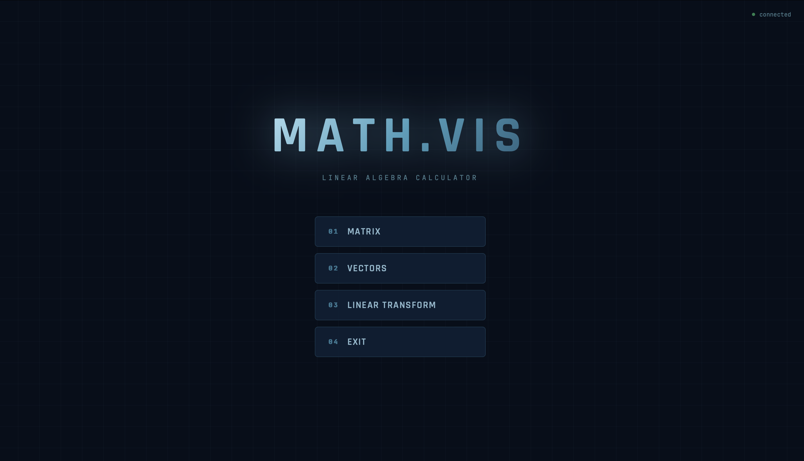
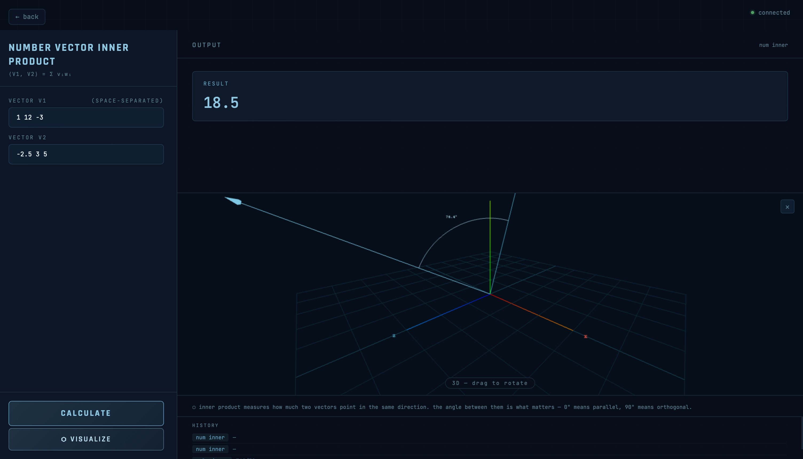
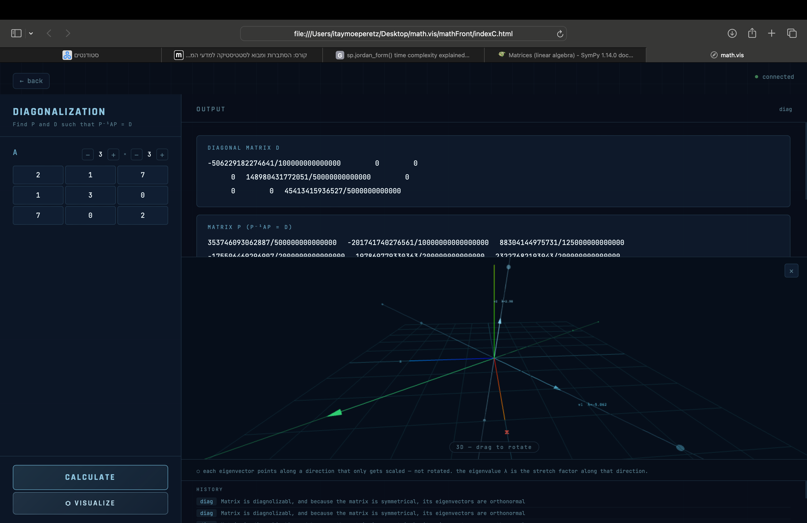
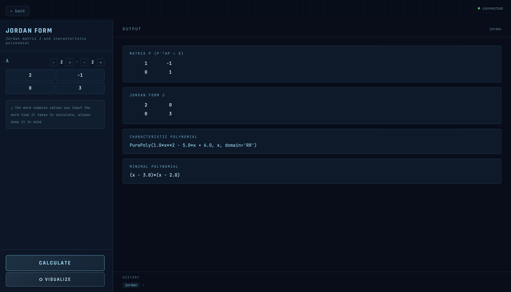

# math-viz-engine



Linear algebra calculator with visualizations — supports matrices, vectors, polynomials, and linear transformations.
Built with a Python/FastAPI backend, vanilla JavaScript frontend, and GPT-4 for natural language input.
Supports complex numbers, diagonalization, Jordan form, Gram-Schmidt, and more.

---

## About The Project

This project is a linear algebra calculator with visualization capabilities.
The goal is to help solve linear algebra problems while also demonstrating the beauty and structure behind them to students and mathematics enthusiasts.

---

## Features

1. Matrix operations such as multiplication, determinant, inverse, and REF (row echelon form)
2. Diagonalization and Jordan form computation, including the matrix ( P ) such that ( P^{-1} A P = D ) or ( J )
3. Inner products for vectors, matrices, and polynomials
4. Gram-Schmidt process for vectors
5. Linear transformation tools:

   * Image and Kernel computation
   * Representing matrix in the standard basis
6. Complex number input support
7. Characteristic and minimal polynomials
8. Natural language input (AI-assisted)
9. Terminal version and full frontend/backend version
10. Additional mathematical utilities

---

## Tech Stack

* **Backend:** Python, FastAPI, NumPy, SymPy
* **Frontend:** HTML, CSS, JavaScript, Three.js
* **AI Integration:** OpenAI API

---

## Installation

Clone the repository:

```bash
git clone https://github.com/itayper-ops/math-viz-engine.git
cd math-viz-engine
```

Install dependencies:

```bash
pip install -r requirements.txt
```

---

## Running the Project

Start the backend server:

```bash
uvicorn backend.main:app --reload
```

Then open the frontend in your browser (or run it using a local server depending on your setup).

---


## Project Structure

```text
math-viz-engine/
├── backend/              # FastAPI backend and mathematical logic
├── frontend/             # Frontend interface
├── screenshots/          # README images and demo screenshots
├── terminal-version/     # Terminal-based version of the project
├── app.py                # Main app entry point
├── test_backend.py       # Backend testing file
├── README.md
├── LICENSE
└── .gitignore
```
---


## Examples

### Linear Transformation

```text
T(x,y,z) = (2x + y, z, x - y)
```

The engine will:

* Verify linearity
* Compute the representing matrix
* Allow further operations (Ker, Im, Jordan form, etc.)

---

### Matrix Example

```text
A = [2, 3]
    [4, i]

b = [2i, 5]
```

The engine will:

* Verify if multiplication is valid
* Compute ( A \cdot b )

---

## Screenshots

### Polynomial Inner Product


### Vector Inner Product + Visualization



### 3x3 Matrix Diagonalization + Visualization



### Jordan Form


---

## Future Improvements

* Add bilinear and quadratic form calculations
* Improve fraction simplification
* Expand to more math domains:

  * Calculus II (integrals, series convergence)
  * Calculus I (functions and sequences limits)
  * Graph Theory

---

## License

This project is licensed under the MIT License.

---

## Acknowledgements

Frontend developed with AI assistance (Claude).
